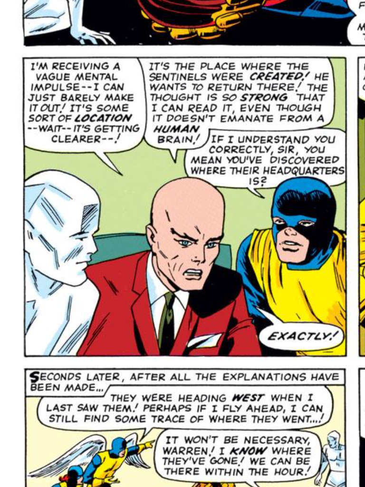

##CLJS-RTC
ClojureScript Library for doing real-time peer to peer communication in the browser!



####Goals
1. Support edn across the network
2. An api built around core.async
3. Binary pack?
4. Good enough browser support

#### WIP syntax
```clojure
(def peer-chan (peer-con config options))
;; returns a channel
(go (while true
  (let [peer-data (<! peer-chan)]
    (do-something peer-data))))
(>! conn “hello”)
```

#### Notes
Close chan when connection lost?
Return map with peer-con?
- This would allow a structure like {:error false :chan chan} or {:error true}.  is this helpful


